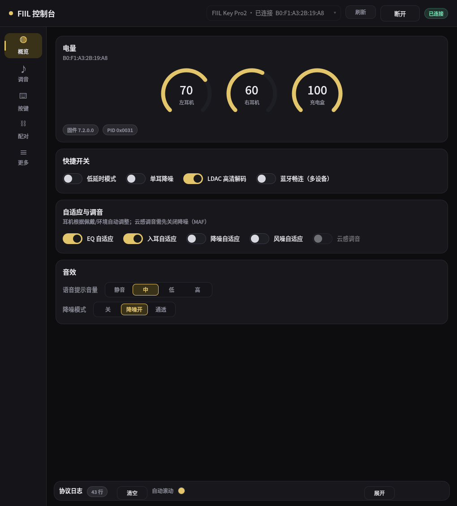
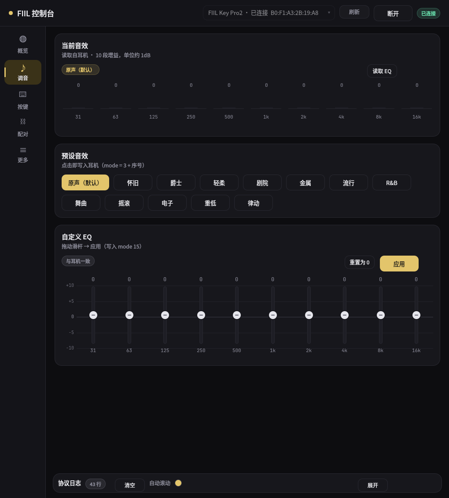
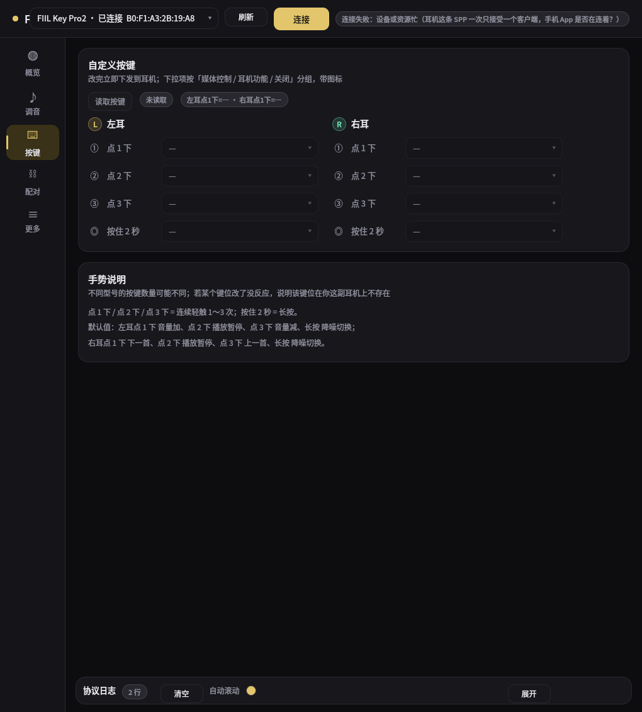

# fiilctl · FIIL 耳机 Linux 控制台（Qt Quick / QML）

用 **Qt6 Quick (QML)** 写的 FIIL 真无线耳机控制台，直接走**经典蓝牙 RFCOMM/SPP**，不需要手机 App，也不需要 QtBluetooth。

**已在真机验证：FIIL Key Pro2（型号码 F049，`B0:F1:A3:2B:19:A8`）** —— 电量 / 固件 / 所有开关 / EQ / 按键映射 / 配对列表，读写全部实测通过。





## 界面

- **顶栏**：设备下拉（自动列出 BlueZ 已知设备，优先 FIIL 并标注「已连接」）、通道号、连接/断开、状态胶囊
- **左侧导航**：概览 / 调音 / 按键 / 配对
- **概览**：三只环形电量（左耳 / 右耳 / 充电盒，充电时显示 ⚡）、固件与 PID、低延时/单耳降噪/LDAC/蓝牙畅连开关、**自适应与调音**（EQ 自适应 / 入耳自适应 / 降噪自适应 / 风噪自适应 / 云感调音）、语音提示音量与降噪模式分段控件
- **调音**：当前音效（模式 + 10 段增益柱状图，占满卡片宽度）、12 个预设 + 原声（默认）、自定义 EQ（10 条竖直滑杆，带 dB 刻度与网格线、从 0dB 双向填充、应用/重置）
- **更多**：播放控制（音量± / 播放暂停 / 上下一首）、语言切换、恢复出厂（两步确认）
- **按键**：按**左耳 / 右耳两栏**列出 4 种手势（点 1 下 / 点 2 下 / 点 3 下 / 按住 2 秒），每项一个带图标的下拉；
  下拉项按「媒体控制 / 耳机功能 / 关闭」分组，选中即下发。顶部还有一行摘要（如「左耳点1下=音量加 · 右耳点1下=下一首」）
- **配对**：耳机记录的配对设备列表（名称/MAC/是否当前连接）+ 连接/断开/删除/进入配对模式
- **协议日志**：底部可折叠面板，TX 金色 / RX 灰色 / 通知绿色，实时滚动

界面全深色 + FIIL 金（`#e3c56b`），卡片圆角、开关与分段控件都带动画；字体用 Noto Sans CJK，日志用 JetBrains Mono。

## 编译运行

```bash
cmake -S . -B build -G Ninja -DCMAKE_BUILD_TYPE=Release
cmake --build build
./build/fiilctl                                  # GUI
./build/fiilctl --list                           # 只打印已知蓝牙设备（调试）
QT_QPA_PLATFORM=offscreen QT_QUICK_BACKEND=software \
    ./build/fiilctl --shot 1 out.png --autoconnect  # 离屏截图（不打扰桌面，可用于出图/自查）
```

装到本机（二进制 + 桌面项 + 图标，之后能在启动器里搜到「FIIL 控制台」）：

```bash
cmake --install build --prefix ~/.local
```

依赖：`qt6-base`、`qt6-declarative`（含 QtQuick.Controls）、`bluez-utils`（提供 `bluetoothctl` 枚举设备）、`bluez-libs` 头文件。

**不需要 QtBluetooth**：RFCOMM 用原生 `AF_BLUETOOTH/SOCK_STREAM/BTPROTO_RFCOMM` + `QSocketNotifier` 实现（`src/rfcomm.cpp`）。

## 使用前提

1. 耳机已与这台电脑配对过（桌面蓝牙设置 / `bluetoothctl pair` 一次即可）
2. 适配器已开：`rfkill unblock bluetooth && bluetoothctl power on`
3. **这条 SPP 一次只接受一个客户端**：手机 App 连着耳机时，Linux 侧会连不上 —— 先退出手机 App

## 协议

见 [`docs/PROTOCOL.md`](docs/PROTOCOL.md)：SDP/RFCOMM 信息、帧格式、命令表、INFO 表、APP_SETTING 表、
帧构造规则、EQ/按键/配对列表的完整格式，以及**型号 × 协议族覆盖范围**。

## 代码结构

| 文件 | 作用 |
|---|---|
| `src/rfcomm.{h,cpp}` | 原生 RFCOMM 客户端（非阻塞 + QSocketNotifier + 发送缓冲） |
| `src/protocol.{h,cpp}` | 帧编解码、串行命令队列（1.5s 超时）、状态缓存、通知解析、能力探测 |
| `src/fiilview.{h,cpp}` | QML 后端：把协议状态暴露成 Q_PROPERTY / Q_INVOKABLE |
| `src/bluetooth_devices.{h,cpp}` | 通过 `bluetoothctl` 枚举设备 |
| `src/main.cpp` | 入口（含 `--list`） |
| `qml/*.qml` | 界面：`Main` + 四个页面 + `Card/Toggle/ActionButton/Pill/Picker/Segmented/BatteryRing` + `Theme` 单例 |

## 实现注意（踩过的坑）

- **Linux 的 RFCOMM 不支持非阻塞 connect**：`O_NONBLOCK` 下 `connect()` 会立刻返回 `EBUSY`。所以连接放在后台线程里用阻塞方式做，连上后再切非阻塞 + `QSocketNotifier`（`src/rfcomm.cpp`）。
- **耳机这条 SPP 一次只接受一个客户端**：手机 App 连着时 Linux 侧连不上，反之亦然。客户端连接/断开都会改变占用方。
- QML 模块里 `qt_add_qml_module` 默认把文件放到 `:/qt/qml/<URI>/qml/`，而 `qmldir` 在 `:/qt/qml/<URI>/` —— 同目录类型能解析，但 `Theme` 单例会变成 undefined。用 `QT_RESOURCE_ALIAS` 把 QML 落到模块根目录即可。

## 已知限制

- 通道号默认 6（Key Pro2）。换型号先用 `bluetoothctl info <MAC>` 确认有 `d52b47bc-…` 这个 SDP UUID。
- 尚未做 UI：OTA 升级（厂商已停运，固件服务器没了；刷写协议已解出）、EQ 曲线导出。
- 语言项 0/1 与中/英文的对应关系未实测（界面按 0=中文、1=English 显示，切换后听提示音确认）。
- 按键「键位序号 ↔ 手势」的对应关系由 App 里左耳的默认映射反推（左耳 4 项 4/4 吻合，见 `docs/PROTOCOL.md`），
  界面上直接按「左耳/右耳 + 手势」展示；若某键位在本型号上不存在，改它不会有反应。
- 老一代 FIIL（Diva / CC / CC Pro2 / T1 / T2 等 ≈17 款）是另一套私有协议（`com.fiil.sdk` + Airoha 芯片），本程序不适用。
